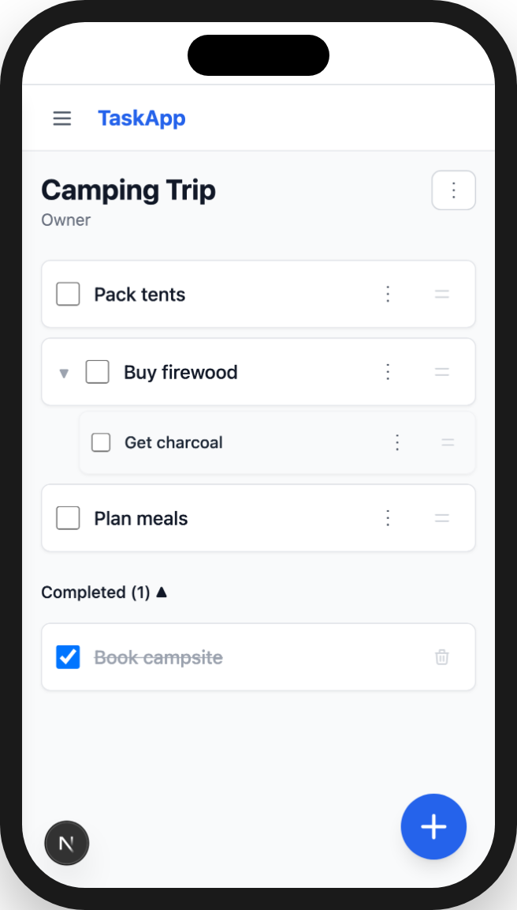
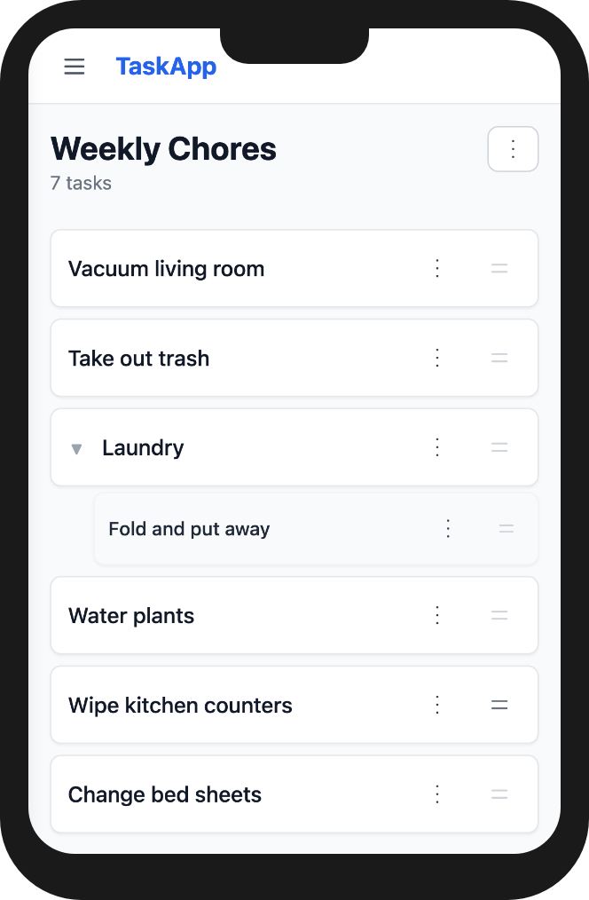
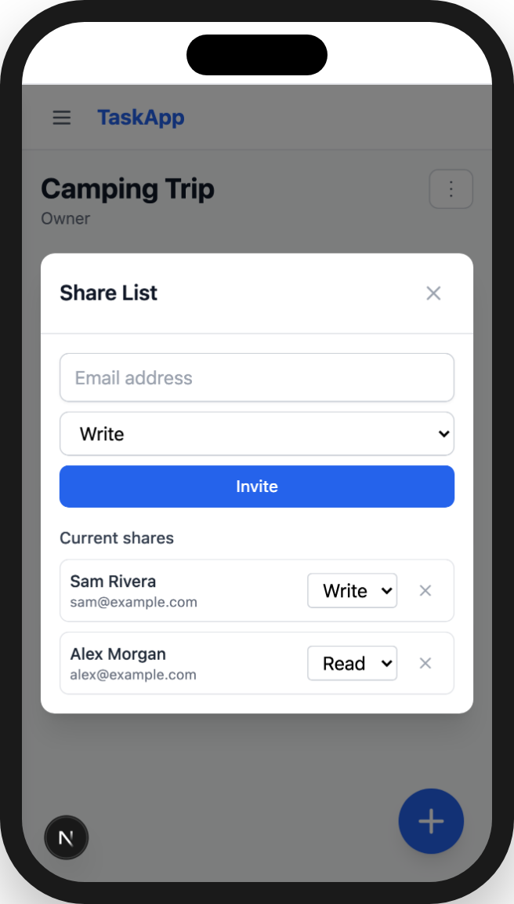

# Task App

Shared task lists for family and friends: lists, subtasks, drag-and-drop ordering, live-ish updates, reusable templates, sharing with READ/WRITE permissions, and a small admin panel. Installable as a PWA on desktop and mobile.

**Stack**: Next.js (App Router) · React + Tailwind · SQLite dialect via [libsql](https://github.com/tursodatabase/libsql) (Drizzle ORM) · playwright-bdd for tests. Deploys to **Vercel + Turso** for free.

<p align="center">
  
  &nbsp;&nbsp;
  
  &nbsp;&nbsp;
  
</p>

---

## Quick start

```bash
git clone <this repo> && cd task-app
cp .env.example .env        # defaults work for local dev
npm install
npm run dev                 # http://localhost:3000
```

Local dev uses an embedded SQLite file (`TURSO_DATABASE_URL=file:./data/app.db`), created and migrated automatically on first request — no database server, no Turso account needed. To make yourself an admin, put your email in `ADMIN_EMAILS` in `.env` before registering (or before your next login).

## Testing

All functional requirements live as Gherkin scenarios in `features/` — they are the spec, and the `@ac`-tagged e2e scenarios are the acceptance criteria (`grep -A1 "@ac" features/e2e/*.feature`).

```bash
npm test              # everything: api + browser (chromium + mobile viewport)
npm run test:api      # 92 API scenarios (fast, no browser)
npm run test:e2e      # 39 browser scenarios, incl. mobile touch
```

Two of those feature files are performance contracts rather than behaviour: `features/api/round-trips.feature` caps the database round trips each hot endpoint may issue, and `features/e2e/optimistic.feature` stalls the API before acting, so a passing assertion proves the UI updated without waiting for a response.

`features/e2e/auth.feature` covers the other side of an unreliable connection: signing out is something only the server can do, so a session check that fails to get an answer must offer a retry rather than a login screen.

The test runner boots `next dev` on port 8099 automatically (or reuses one you've started). First run needs `npx playwright install chromium`.

### Latency benchmark

A separate stopwatch suite measures how the app feels over a slow connection — it delays every API request client-side and charges each database statement a simulated Turso round trip, then reports how long each interaction takes to *look* done versus to actually finish.

```bash
PERF_LABEL=before npm run test:perf     # baseline
PERF_LABEL=after  npm run test:perf     # after your change
npm run perf:compare before after
```

It builds and runs a production server on its own port (8098), so it never reuses a dev server. See [`tests/perf/README.md`](tests/perf/README.md).

## Deployment

Deploys to **Vercel + Turso** — both free tiers cover a family-and-friends workload with enormous headroom, and there are no servers to maintain.

Environment keys (see `.env.example`): `TURSO_DATABASE_URL`, `TURSO_AUTH_TOKEN` (remote DBs only), `JWT_SECRET`, `ADMIN_EMAILS` (optional), `COOKIE_SECURE` (local dev only — Vercel defaults to secure).

1. Fork or clone this repo to your GitHub account, then import it at [vercel.com/new](https://vercel.com/new). The build is preconfigured: Vercel runs `vercel-build` (applies pending Drizzle migrations to your database, then `next build`).
2. In the Vercel project, add the **Turso integration** from the Marketplace storage tab — it provisions a database and injects `TURSO_DATABASE_URL` and `TURSO_AUTH_TOKEN` automatically. (Alternatively, create a DB with the [Turso CLI](https://docs.turso.tech/cli) and set those two env vars by hand.)
3. Add env vars: `JWT_SECRET` (`openssl rand -hex 32`) and optionally `ADMIN_EMAILS`.
4. Deploy. Every later push to `main` deploys automatically; every PR gets a preview URL running against the same database — use a second Turso DB (or a [branched database](https://docs.turso.tech/features/branching)) for previews if you want isolation.

### Importing existing data

Turso can create a database directly from a SQLite file:

```bash
turso db create taskapp --from-file path/to/app.db
turso db show taskapp --url          # -> TURSO_DATABASE_URL
turso db tokens create taskapp      # -> TURSO_AUTH_TOKEN
```

If the file was written in WAL mode, produce a clean single-file copy first: `sqlite3 app.db "VACUUM INTO 'clean.db'"`.

### Backups

`turso db shell taskapp .dump > backup.sql`, or export back to a local file with `turso db export`. Cron it if you're paranoid — the whole database is tiny.

## Customizing

- Schema lives in `db/schema.ts` (Drizzle). After changing it: `npm run db:generate` writes SQL migrations to `drizzle/`, applied automatically on boot.
- API route handlers are in `app/api/`, one directory per resource, delegating to `lib/services/`.
- Pages/components are plain client-side React with react-query in `app/`, `components/`, `hooks/`.
- Add scenarios to `features/` first — the suite is the safety net that keeps your fork working.
